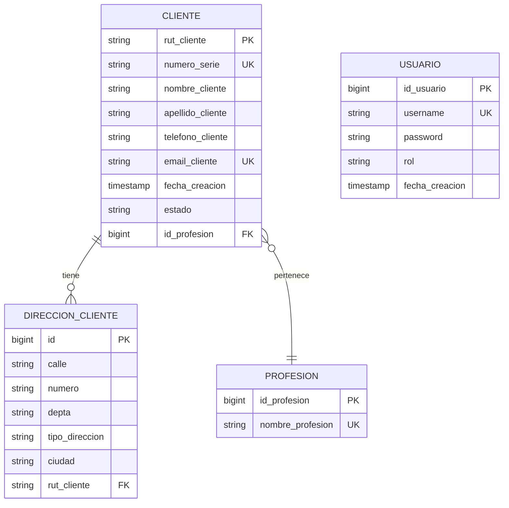
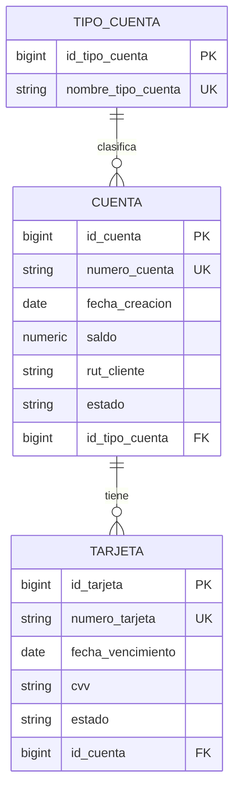
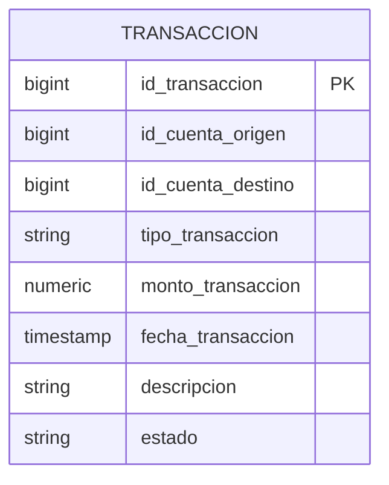
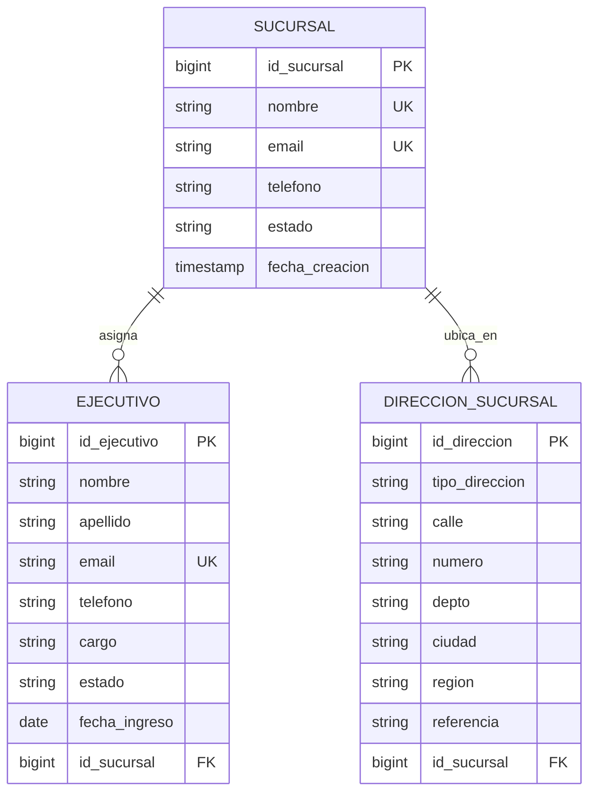
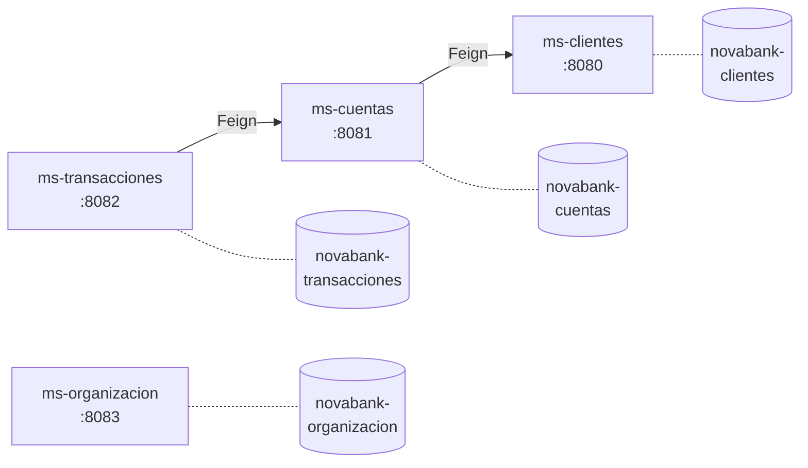

# Diagrama Entidad-Relación

Modelo relacional de Banco NovaBank, separado por microservicio. Cada microservicio mantiene su propia base de datos con schema independiente.

---

## ms-clientes (schema: novabank-clientes)

**Relaciones:**
- Un cliente pertenece a una profesión (`@ManyToOne`).
- Un cliente puede tener múltiples direcciones (`@OneToMany`, cascade).
- Usuario es autónomo (autenticación con BCrypt).

---

## ms-cuentas (schema: novabank-cuentas)

**Relaciones:**
- Una cuenta pertenece a un tipo de cuenta (`@ManyToOne`).
- Una cuenta puede tener múltiples tarjetas (`@OneToMany`).
- `rut_cliente` es un **identificador externo** (no FK JPA) — la validación de existencia se hace vía Feign a ms-clientes.

---

## ms-transacciones (schema: novabank-transacciones)

**Relaciones:**
- `id_cuenta_origen` e `id_cuenta_destino` son **identificadores externos** — validación de cuentas vía Feign a ms-cuentas.
- No hay foreign keys JPA cross-microservicio (respeta el principio Database per Service).

---

## ms-organizacion (schema: novabank-organizacion)

**Relaciones:**
- Una sucursal puede tener múltiples ejecutivos (`@OneToMany`).
- Una sucursal puede tener múltiples direcciones físicas (`@OneToMany`).

---

## Convenciones de la base de datos

| Concepto | Implementación |
|---|---|
| Identificadores numéricos | `BIGINT GENERATED BY DEFAULT AS IDENTITY` (PostgreSQL) |
| Identificadores naturales | `VARCHAR` (ej: `rut_cliente`) |
| Decimales monetarios | `NUMERIC(19, 2)` |
| Enumeraciones | `VARCHAR(15)` con `CHECK` constraint |
| Fechas con hora | `TIMESTAMP WITHOUT TIME ZONE` |
| Fechas | `DATE` |
| Validación de unicidad | `UNIQUE` constraints (`UK`) |
| Integridad referencial | `FOREIGN KEY` interna por microservicio |

---

## Comunicación entre microservicios

**Flujos:**

- **Crear cuenta:** `ms-cuentas` valida vía Feign que el `rutCliente` exista en `ms-clientes` antes de persistir.
- **Crear transacción:** `ms-transacciones` consulta cuentas en `ms-cuentas`, valida estado ACTIVA, aplica `retirar` y `depositar` vía Feign.
- `ms-organizacion` es autónomo: gestiona la estructura interna del banco sin depender de los demás.
